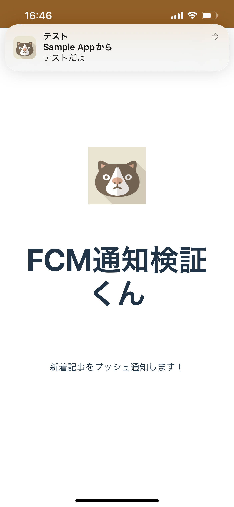

# PWAとFirebase Cloud MessagingによるPUSH通知のサンプル

### 画面
React + Vite

## ざっくり事前準備
- Firebaseプロジェクト作っとく
- FirestoreとMessagingを使える様にしとく
- FirebaseのAPIKEYとかを設定する
  - firebase-messaging-sw.js: サービスワーカでバックグラウンドでPUSH通知を受信するため
  - firebase.ts: FCMでトークン取得したり、Firestoreにトークン保存したりするため
- vercelとかどっかに適当にデプロイする

## ざっくり使い方
- どこかにデプロイしたURLを、iOSのsafariかAndroidのchromeで開き、ホーム画面に追加してPWAとして使う。
- 画面真ん中に「通知を受け取る」ボタンがあるので、許可する。
- Firebaseのコンソールから、FCMのテストでトークン指定してPUSH通知して、通知が来るか確認する。